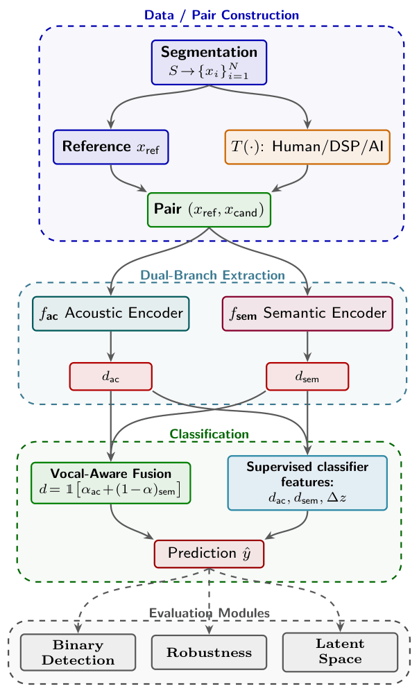

# AI-Generated Music Plagiarism Detection as Version Identification

>This is the official repository for the COPYCAT paper. It includes the full reproducibility pipeline for the COPYCAT benchmark (350,654 evaluation pairs),the supervised shift modeling framework, pretrained embeddings (CLEWS + WEALY), and the final Hybrid Top-512 classifier. We do not redistribute the raw SMP audio due to copyright restrictions.

## Abstract

The rapid proliferation of Text-to-Music generative models challenges traditional paradigms of music creation and intellectual property. Plagiarism in this context is rarely an absolute mathematical binary, but an ambiguous threshold negotiated over harmonic structure, melodic contours, or overall perceived stylistic character. In this work, we test the transferability of state-of-the-art Music Version Identification architectures from the human-to-human cover domain to the human-to-AI plagiarism setting. To evaluate this task, we introduce *COPYCAT*, a benchmark derived from real-world plagiarism cases and extended through generative re-synthesis and digital signal processing obfuscations, yielding 350,654 evaluation pairs. We show that scalar distance thresholding collapses under generative re-synthesis, while a supervised framework leveraging coordinate-wise embedding shifts recovers the dispersed plagiarism signal, raising overall $F_{0.5}$ from $0.612$ to $0.803$.

## Authors

Fotis Koutsikos, Ioannis Prokopiou, Spyridon Kantarelis, Vassilis Lyberatos, 
Pantelis Vikatos, Themos Stafylakis, Athanasios Voulodimos, & Giorgos Stamou.

---

## Pipeline Overview



*End-to-end framework: from segment extraction and multi-source generation (human plagiarism, DSP obfuscation, AI re-synthesis) through dual-branch embedding (CLEWS acoustic + WEALY semantic) to supervised shift-based classification.* 

---

## Key Results

Category-wise performance on the **COPYCAT** benchmark. Best $F_{0.5}$ per category in **bold**.

| Category                 | Pairs   | WEALY $F_{0.5}$ | CLEWS $F_{0.5}$ | Hybrid Top-512 $F_{0.5}$ |
|--------------------------|---------|-----------|-----------|------------------------|
| Human Plagiarism         | 3,757   | 54.0%     | 68.0%     | **94.9%** $\pm$ 0.2%   |
| Human Plagiarism + DSP   | 37,570  | 52.3%     | 64.5%     | **94.0%** $\pm$ 0.2%   |
| Original + DSP           | 12,190  | 55.7%     | **96.5%** | 89.4% $\pm$ 0.3%       |
| AI Generation            | 5,472   | 43.9%     | 43.8%     | **70.5%** $\pm$ 0.3%   |
| AI + DSP                 | 54,701  | 36.0%     | 33.9%     | **66.2%** $\pm$ 0.4%   |
| **Overall**              | 113,690 | 43.5%     | 61.2%     | **80.3%** $\pm$ 0.3%   |

> Hybrid Top-512 results are reported as mean over 10 random seeds. See paper for full precision/recall breakdown and confidence intervals.

---

## Table of Contents
1. [System Architecture & Overview](#-system-architecture--overview)
2. [Directory & File Structure](#-directory--file-structure)
3. [Execution Order & Pipeline Workflow](#-execution-order--pipeline-workflow)
   - [Phase 1: Feature Extraction & Data Preparation](#phase-1-feature-extraction--data-preparation)
   - [Phase 2: Baseline Unsupervised Evaluation (Distance & Thresholding)](#phase-2-baseline-unsupervised-evaluation-distance--thresholding)
   - [Phase 3: Supervised Machine Learning Pipeline](#phase-3-supervised-machine-learning-pipeline)
   - [Phase 4: Diagnostic, Robustness & XAI Analyses](#phase-4-diagnostic-robustness--xai-analyses)
   - [Phase 5: Production Training & Real-Time Inference](#phase-5-production-training--real-time-inference)
4. [File Breakdown & Responsibilities](#-file-breakdown--responsibilities)
5. [Reproducibility Guide](#-reproducibility-guide)

---

## System Architecture & Overview

The framework evaluates music plagiarism through a multi-tiered approach:
1. **Multimodal Embedding Extraction**:
   - **CLEWS (Acoustic Branch)**: CQT-based ResNet50 backbone extracting 1024-dimensional acoustic/melodic representations.
   - **WEALY (Semantic Branch)**: Whisper Decoder Latent Adaptations via a Transformer Encoder extracting 512-dimensional vocal/semantic representations.
2. **Metric Learning & Distance Computation**: Evaluates Cosine, Euclidean, Manhattan, and Pearson metrics across pairs with varying difficulty (Random, Intra-Category, Global Hard Negatives).
3. **Score-Level Fusion**: Late-fusion strategy combining acoustic and semantic metrics using dynamic vocal-aware fallback policies.
4. **Supervised Classification (XGBoost)**: Feature engineering (distances, delta summary statistics, Top-K XAI dimensions) and hybrid XGBoost modeling optimized strictly for $F_{0.5}$-Score (precision-heavy) with Stratified Group K-Fold cross-validation to prevent data leakage.
5. **Explainable AI (XAI)**: Latent space drift, stable-core preservation, and Cohen's $d$ feature effect analysis.

---

## Directory & File Structure

```text
Plagiarism-Detection-System/
├── configs/                  # Model configurations
│   └── extraction/
│       ├── clews.yaml        # CLEWS architecture & settings
│       └── wealy.yaml        # WEALY Transformer & Whisper settings
├── data/                     # Primary datasets and generated embeddings
│   ├── classifier_features.parquet
│   ├── clews_embeddings.parquet
│   ├── evaluation_master_pairs.csv
│   └── wealy_embeddings.parquet
├── logs/                     # Execution logs for each pipeline stage
├── models/                   # Serialized production models
│   └── final_plagiarism_detector.pkl
├── notebooks/                # Exploratory notebooks and data preparation
├── plots/                    # Output figures (PDF) grouped by phase
│   ├── attribution/
│   ├── classification/
│   ├── explainability/
│   ├── fusion/
│   ├── negative_tiers/
│   ├── robustness/
│   ├── stem_analysis/
│   ├── threshold/
│   └── umap/
├── results/                  # Exported metrics (CSV/Parquet) grouped by experiment
│   ├── attribution/
│   ├── binary_classification/
│   ├── classification/
│   ├── distances/
│   ├── explainability/
│   ├── fusion/
│   ├── pairs/
│   ├── robustness/
│   ├── stem_analysis/
│   ├── threshold/
│   └── vocal_detection/
└── src/                      # Source code
    ├── classification/       # Supervised learning scripts
    │   ├── ablation.py
    │   ├── classification.py
    │   ├── hybrid_experiments.py
    │   ├── selected_model_evaluation.py
    │   ├── binary_supervised_classification.py
    │   └── train_final_model.py
    ├── evaluation/           # Pipeline evaluation scripts
    │   ├── build_pairs.py
    │   └── analysis/
    │       ├── binary_classification.py
    │       ├── explainability.py
    │       ├── fusion_optimization.py
    │       ├── metrics.py
    │       ├── musical_attribution.py
    │       ├── optimal_threshold.py
    │       ├── plot_negative_tiers.py
    │       ├── robustness_analysis.py
    │       ├── stem_analysis.py
    │       └── umap_analysis.py
    ├── inference/            # Feature extraction and prediction endpoints
    │   ├── extract_clews.py
    │   ├── extract_wealy.py
    │   ├── predict_pair.py
    │   └── vocal_detection.py
    └── utils/                # Shared utilities and core helpers
        ├── categorization.py
        ├── classifier_features.py
        ├── clews_lib.py
        ├── constants.py
        ├── dataset_builder.py
        ├── logging_util.py
        ├── vocal_metadata.py
        └── wealy_lib.py
```

---

## Execution Order & Pipeline Workflow

To guarantee full **reproducibility** of the results, scripts must be executed in the exact sequential order defined below. Each stage generates input dependencies for the subsequent stages.

```
┌────────────────────────────────────────────────────────────────────────────────────────┐
│                                 PIPELINE EXECUTION FLOW                                │
├────────────────────────────────────────────────────────────────────────────────────────┤
│                                                                                        │
│ [STAGE 0: PREPROCESSING & FEATURE EXTRACTION]                                          │
│   1. src/inference/vocal_detection.py    ──> Estimates source-level vocal validity     │
│   2. src/inference/extract_clews.py      ──> Extracts 1024D CLEWS embeddings           │
│   3. src/inference/extract_wealy.py      ──> Extracts 512D WEALY embeddings            │
│                                   │                                                    │
│                                   ▼                                                    │
│ [STAGE 1: EVALUATION PAIR BUILDING & DATASET ANALYSIS]                                 │
│   4. src/evaluation/build_pairs.py       ──> Constructs master evaluation pairs        │
│   5. src/evaluation/analysis/dataset_analysis.py ──> Descriptive dataset breakdown     │
│                                   │                                                    │
│                                   ▼                                                    │
│ [STAGE 2: DISTANCE COMPUTATION & THRESHOLD BASELINES]                                  │
│   6. src/evaluation/analysis/metrics.py  ──> Computes distance metrics                 │ 
│   7. src/evaluation/analysis/fusion_optimization.py ──> Score-level CLEWS+WEALY fusion │
│   8. src/evaluation/analysis/optimal_threshold.py ──> Threshold optimization (F0.5)    │
│   9. src/evaluation/analysis/binary_classification.py ──> Baseline distance metrics    │
│                                   │                                                    │
│                                   ▼                                                    │
│ [STAGE 3: FEATURE TABLE & SUPERVISED MACHINE LEARNING]                                 │
│  10. src/utils/classifier_features.py   ──> Assembles unified feature parquet          │
│  11. src/classification/ablation.py      ──> Feature ablation study (Phases 1-3)       │
│  12. src/classification/hybrid_experiments.py ──> Engineered + Raw Top-K experiments   │
│  13. src/classification/selected_model_evaluation.py ──> Deep diagnostic evaluation    │
│  14. src/classification/binary_supervised_classification.py ──> Final supervised table │
│                                   │                                                    │
│                                   ▼                                                    │
│ [STAGE 4: DIAGNOSTICS, ATTRIBUTION & XAI]                                              │
│  15. src/evaluation/analysis/explainability.py ──> Dimensional XAI & latent shift      │
│  16. src/evaluation/analysis/robustness_analysis.py ──> DSP stress testing             │
│  17. src/evaluation/analysis/musical_attribution.py ──> 4-Way source identification    │
│  18. src/evaluation/analysis/stem_analysis.py ──> Stem-level inpainting analysis       │
│  19. src/evaluation/analysis/umap_analysis.py ──> Latent space drift visualization     │
│  20. src/evaluation/analysis/plot_negative_tiers.py ──> Negative mining verification   │
│                                   │                                                    │
│                                   ▼                                                    │
│ [STAGE 5: PRODUCTION MODEL TRAINING & INFERENCE]                                       │
│  21. src/classification/train_final_model.py ──> Exports production .pkl artifact      │
│  22. src/inference/predict_pair.py      ──> Single-pair real-time prediction CLI       │
│                                                                                        │
└────────────────────────────────────────────────────────────────────────────────────────┘
```

---

## File Breakdown & Responsibilities
### Stage 0: Preprocessing & Feature Extraction
* `src/inference/vocal_detection.py`
  - **Function**: Performs VAD and energy-band heuristic checks on Demucs-separated vocal stems.
  - **Output**: `results/vocal_detection/vocal_ratios_source.csv`
* `src/inference/extract_clews.py`
  - **Function**: Extracts 1024D acoustic embeddings from audio waveforms using CQT + ResNet50.
  - **Output**: `data/clews_embeddings.parquet`
* `src/inference/extract_wealy.py`
  - **Function**: Extracts 512D semantic embeddings from Whisper-Turbo decoder latents.
  - **Output**: `data/wealy_embeddings.parquet`

---

### Stage 1: Dataset Construction & Descriptive Statistics
* `src/evaluation/build_pairs.py`
  - **Function**: Constructs the master evaluation set (`evaluation_master_pairs.csv`) containing ground-truth positive pairs and mined negative pairs across three difficulty tiers (*Random*, *Intra-Category Nearest*, *Global Hard Nearest*).
  - **Inputs**: `clews_embeddings.parquet`, SMP metadata.
  - **Outputs**: `data/evaluation_master_pairs.csv`, `evaluation_master_pairs_summary.csv`
* `src/evaluation/analysis/dataset_analysis.py`
  - **Function**: Generates descriptive dataset statistics, segment inventories, and 10 publication-quality summary plots.
  - **Outputs**: CSV summaries in `results/` and PDF plots in `plots/`.

---

### Stage 2: Distance Computation, Threshold Calibration & Fusion Baselines
* `src/evaluation/analysis/metrics.py`
  - **Function**: Computes 4 distance metrics (Cosine, Euclidean, Manhattan, Pearson) on the unified pair benchmark.
  - **Outputs**: `results/distances/{clews,wealy}_distances.csv`
* `src/evaluation/analysis/fusion_optimization.py`
  - **Function**: Performs exhaustive grid search (336 configs) for late score-level fusion
   $$d = α \cdot d_{CLEWS} + (1-α) \cdot d_{WEALY}$$
  with a vocal-aware fallback policy.
  - **Outputs**: `results/fusion/optimal_fused_distances.csv`, heatmaps, alpha curves.
* `src/evaluation/analysis/optimal_threshold.py`
  - **Function**: Evaluates distance metrics using 5-Fold Stratified CV, optimizing decision thresholds for $F_{0.5}$-score.
  - **Outputs**: `results/threshold/threshold_analysis_summary.csv`, PR curves, KDE distribution plots.
* `src/evaluation/analysis/binary_classification.py`
  - **Function**: Evaluates deterministic threshold-based classification and conducts triple-tier error analysis.
  - **Outputs**: Broad, detailed, and FP tier breakdown CSVs in `results/binary_classification/`.

---

### Stage 3: Supervised Machine Learning Pipeline
* `src/utils/classifier_features.py`
  - **Function**: Constructs the master feature table (`classifier_features.parquet`), unifying CLEWS/WEALY distances, 22 delta summary stats and vocal flags without data leakage.
  - **Output**: `data/classifier_features.parquet`
* `src/classification/classification.py`
  - **Function**: Core parameterized execution engine for supervised XGBoost experiments using 5-Fold StratifiedGroupKFold CV (grouped by `filename_ori`), dynamic `scale_pos_weight`, out-of-fold (OOF) tracking, and multi-seed statistical evaluation.
* `src/classification/ablation.py`
  - **Function**: Runs 3 ablation phases: (1) Engineered feature families, (2) Raw full embedding deltas, (3) Top-K dimension convergence curve vs. compute trade-offs.
  - **Outputs**: `ablation_results.csv`, `topk_convergence_curve.pdf`, etc.
* `src/classification/hybrid_experiments.py`
  - **Function**: Evaluates hybrid combinations of 24 base engineered features + Top-$K$ ($K \in \{256, 512, 1024\}$) raw CLEWS dimensions ranked by mean positive shift.
  - **Outputs**: `hybrid_results.csv`, `hybrid_f05_comparison.pdf`
* `src/classification/selected_model_evaluation.py`
  - **Function**: Runs deep diagnostic analysis (triple-tier error analysis + permutation feature importance) on selected candidates.
  - **Outputs**: Granular metric breakdowns and feature importance plots in `results/classification/` and `plots/classification/`.
* `src/classification/binary_supervised_classification.py`
  - **Function**: Formats and exports final supervised classification results for direct comparison with unsupervised baselines.
  - **Outputs**: `results/binary_supervised_classification/`

---

### Stage 4: Diagnostics, Attribution & Latent Space Analysis
* `src/evaluation/analysis/explainability.py`
  - **Function**: Conducts latent space analysis: delta vectors, Top-30 affected dimensions, directional shift heatmaps, Cohen's $d$ discrimination (Human vs. AI), and stable-core preservation.
  - **Outputs**: Extensive PDF plots and CSV dimension rankings in `explainability/`.
* `src/evaluation/analysis/robustness_analysis.py`
  - **Function**: Stress-tests distance stability under continuous Pitch/Tempo DSP shifts and extreme modifications.
  - **Outputs**: Distance trendline plots and extreme stress test boxplots.
* `src/evaluation/analysis/musical_attribution.py`
  - **Function**: Evaluates 4-Way Forced Choice Retrieval (Positive vs. Random, Intra-Category, Global Hard Negatives) measuring Top-1 Accuracy, MRR, and Mean Rank.
  - **Outputs**: Attribution CSVs and rank distribution plots.
* `src/evaluation/analysis/stem_analysis.py`
  - **Function**: Evaluates inherent embedding distances of MGE-LDM stem-guided generations (bass, drums, other).
  - **Outputs**: Stem base generation comparison plots with threshold reference lines.
* `src/evaluation/analysis/umap_analysis.py`
  - **Function**: Visualizes 2D centered latent space trajectories using UMAP projection with cosine metric.
  - **Outputs**: `plots/umap/{clews,wealy}_umap_plot.pdf`
* `src/evaluation/analysis/plot_negative_tiers.py`
  - **Function**: Visualizes distance distributions across negative mining difficulty tiers.
  - **Outputs**: `plots/negative_tiers/*.pdf`

---

### Stage 5: Production Deployment & Inference
* `src/classification/train_final_model.py`
  - **Function**: Reconstructs the winning feature configuration (`hybrid_top512`), calibrates decision thresholds on hold-out split, retrains XGBoost on 100% of data, and packages training reference statistics into a single artifact.
  - **Output**: `models/final_plagiarism_detector.pkl`
* `src/inference/predict_pair.py`
  - **Function**: Single-pair CLI interface that extracts embeddings live, computes distances and delta summaries using training reference stats, and outputs probability + binary prediction.
  - **Usage**:
    ```bash
    python src/inference/predict_pair.py --ori path/to/original.wav --mod path/to/modified.wav
    ```

---

## Reproducibility Guide

To reproduce all results and generated artifacts from scratch:

### 1. Environment Setup
Clone the repository and install all required dependencies:

​`​`​`bash

git clone https://github.com/fotiskoutsikos/Plagiarism-Detection-System.git
cd Plagiarism-Detection-System
pip install -r requirements.txt

​`​`​`

### 2. SMP Dataset Acquisition

The COPYCAT benchmark is built on top of the [Similar Music Pair (SMP)](https://github.com/Mippia/smp_dataset.git) dataset, which contains 70 real-world plagiarism disputes. **Due to copyright restrictions, we do not redistribute the raw audio.**

To reproduce our results, you need to obtain the SMP audio independently:

1. Consult the official SMP repository for metadata and licensing information.
2. Use the YouTube links provided in `data/Final_dataset_pairs.csv` to obtain the audio files.
3. Organize the downloaded files under `data/final_dataset/` in the following structure:

```bash
data/final_dataset/
├── 1/
│   ├── <ori_title>.wav
│   └── <comp_title>.wav
├── 2/
│   ├── <ori_title>.wav
│   └── <comp_title>.wav
...
├── 70/

```

where `<ori_title>` and `<comp_title>` match the values in `Final_dataset_pairs.csv` for each `pair_number`.

> **Disclaimer:** Obtaining the audio is the user's responsibility. The authors assume no liability for copyright compliance.

### 3. Sequential Pipeline Execution
Run the pipeline scripts in the exact sequence specified in the [Execution Order & Pipeline Workflow](#-execution-order--pipeline-workflow) section:

​`​``bash

  # 1. Feature Extraction & Dataset Preparation
  python src/inference/vocal_detection.py
  python src/inference/extract_clews.py
  python src/inference/extract_wealy.py
  python src/evaluation/build_pairs.py
  python src/evaluation/analysis/dataset_analysis.py

  # 2. Distance Computation & Baseline Thresholding
  python src/evaluation/analysis/metrics.py
  python src/evaluation/analysis/fusion_optimization.py
  python src/evaluation/analysis/optimal_threshold.py
  python src/evaluation/analysis/binary_classification.py

  # 3. Feature Assembly & Supervised Machine Learning
  python src/utils/classifier_features.py
  python src/classification/ablation.py
  python src/classification/hybrid_experiments.py
  python src/classification/selected_model_evaluation.py
  python src/classification/binary_supervised_classification.py

  # 4. Diagnostic & Explainability Analyses
  python src/evaluation/analysis/explainability.py
  python src/evaluation/analysis/robustness_analysis.py
  python src/evaluation/analysis/musical_attribution.py
  python src/evaluation/analysis/stem_analysis.py
  python src/evaluation/analysis/umap_analysis.py
  python src/evaluation/analysis/plot_negative_tiers.py

  # 5. Production Artifact Generation
  python src/classification/train_final_model.py

​`​``​

### 4. Inference
To test any arbitrary pair of audio files against the final trained model:

​`​``bash
python src/inference/predict_pair.py --ori sample1.wav --mod sample2.wav
​`​`​`